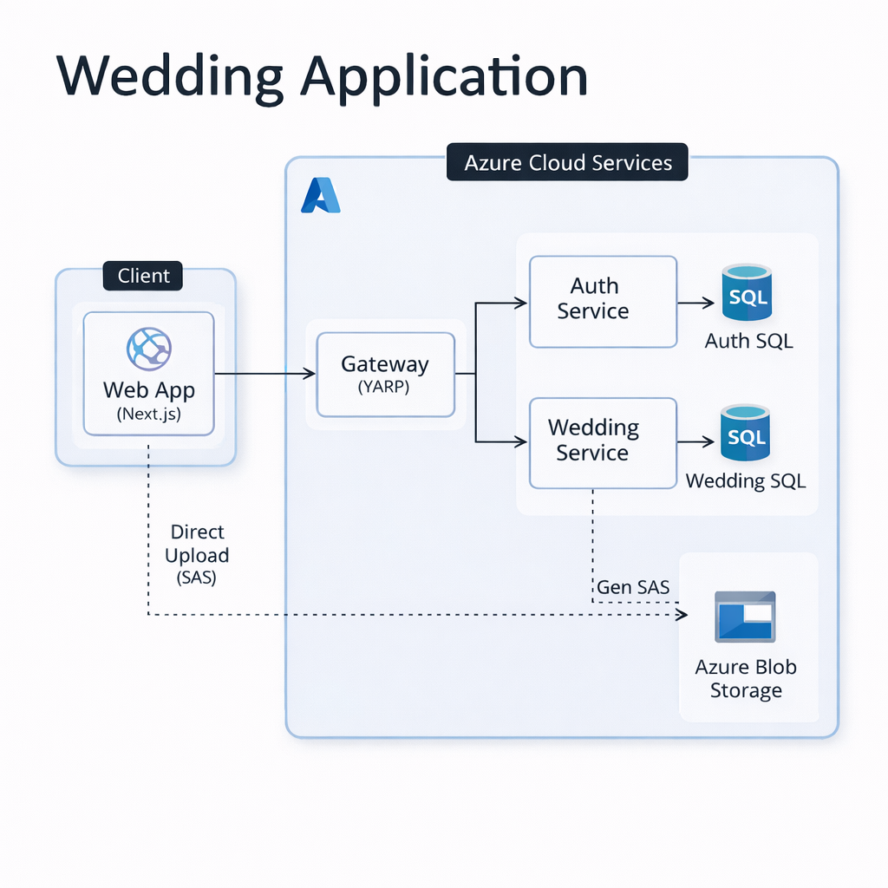

# Trăm Năm - Wedding Invitation

**Modern Digital Wedding Invitations**

Clean Architecture • Microservices • .NET 8 • Next.js 16 • Docker • Azure

---

## 📋 Table of Contents
- [Project Overview](#-project-overview)
  - [Architecture Diagram](#architecture-diagram)
- [Technology Stack, Design Patterns, Infrastructure & Architecture](#technology-stack-design-patterns-infrastructure--architecture)
  - [Infrastructure](#infrastructure)
  - [Back-end](#back-end)
  - [Front-end](#front-end)
  - [Design Patterns](#design-patterns)
  - [Architecture](#architecture)
- [Microservices Overview](#microservices-overview)
- [Web Applications](#web-applications)
- [Project Structure](#project-structure)
- [Getting Started](#getting-started)
  - [Prerequisites](#prerequisites)
  - [Environment Configuration](#environment-configuration)
  - [Running Backend](#running-backend)
  - [Running Frontend](#running-frontend)
- [API Gateway Routes](#api-gateway-routes)

---

## 🚀 Project Overview
**Trăm Năm** is a comprehensive platform for creating, managing, and sharing digital wedding invitations. It leverages a microservices architecture backend and a modern Next.js frontend to provide a seamless experience for couples and guests. The system is designed for high performance, scalability, and ease of maintenance, utilizing industry-standard patterns like **Clean Architecture** and **CQRS**.

### 🌐 Live Product & API
- **Product Site**: [https://tramnam.online](https://tramnam.online)
- **Swagger API**: [API Documentation](https://gateway.yellowdune-48bb28e2.southeastasia.azurecontainerapps.io/swagger/index.html)

### Architecture Diagram



---

## Technology Stack, Design Patterns, Infrastructure & Architecture

### Infrastructure
- **[`Docker`](https://www.docker.com/)** - Containerization platform for consistent development and deployment environments.
- **[`Azure Container Apps`](https://azure.microsoft.com/en-us/products/container-apps)** - Serverless container platform for running microservices.
- **[`SQL Server`](https://www.microsoft.com/en-us/sql-server)** - Relational database management system for structured data (Identity, Wedding Details).
- **[`Azure Blob Storage`](https://azure.microsoft.com/en-us/products/storage/blobs)** - Massively scalable object storage for cloud-native workloads (Images, Music).

### Back-end
- **[`.NET 8`](https://dotnet.microsoft.com/)** - An LTS version of the .NET platform for building high-performance services.
- **[`ASP.NET Core Web API`](https://learn.microsoft.com/en-us/aspnet/core/web-api/)** - Framework for building HTTP services.
- **[`YARP`](https://microsoft.github.io/reverse-proxy/)** - A high-performance reverse proxy toolkit for building the API Gateway.
- **[`EF Core 8`](https://learn.microsoft.com/en-us/ef/core/)** - Modern object-database mapper for .NET.
- **[`MediatR`](https://github.com/jbogard/MediatR)** - implementation of the Mediator pattern for in-process messaging (CQRS).
- **[`AutoMapper`](https://automapper.org/)** - Convention-based object-object mapper to simplify mapping between DTOs and Entities.
- **[`FluentValidation`](https://docs.fluentvalidation.net/)** - Library for building strongly-typed validation rules.
- **[`JwtBearer`](https://learn.microsoft.com/en-us/aspnet/core/security/authentication/jwt-auth)** - Middleware for handling JSON Web Token (JWT) authentication.
- **[`Swagger/OpenAPI`](https://swagger.io/)** - Tools for API documentation and interactive testing.

### Front-end
- **[`Next.js 16`](https://nextjs.org/)** - React framework with App Router and Turbopack for distinct performance.
- **[`React 19`](https://react.dev/)** - The library for web and native user interfaces.
- **[`TypeScript 5.9`](https://www.typescriptlang.org/)** - Strongly typed programming language that builds on JavaScript.
- **[`Tailwind CSS v4`](https://tailwindcss.com/)** - A utility-first CSS framework for rapid UI development.
- **[`Radix UI`](https://www.radix-ui.com/)** - Unstyled, accessible (WAI-ARIA compliance) UI primitives.
- **[`Zustand`](https://github.com/pmndrs/zustand)** - A small, fast, and scalable bearbones state-management solution.
- **[`React Hook Form`](https://react-hook-form.com/)** - Performant, flexible, and extensible forms with easy validation.
- **[`Zod`](https://zod.dev/)** - TypeScript-first schema declaration and validation library.
- **[`Next-intl`](https://next-intl-docs.vercel.app/)** - Internationalization for Next.js.
- **[`Sonner`](https://sonner.emilkowal.ski/)** - An opinionated toast component for React.
- **[`MapLibre GL`](https://maplibre.org/)** - Open-source JavaScript library for publishing maps (used with Track Asia).

### Design Patterns
- **Clean Architecture** - Separation of concerns into independent layers (Domain, Application, Infrastructure, API).
- **CQRS (Command Query Responsibility Segregation)** - Segregating operations that read data from operations that update data using MediatR.
- **Mediator Pattern** - Encapsulating how objects interact to promote loose coupling.
- **Repository Pattern** - Abstraction of the data layer to decouple business logic from data access.
- **Option Pattern** - Strongly typed access to configuration settings.

### Architecture
The backend services follow the **Clean Architecture** principles:

1.  **Domain Layer**: Contains enterprise logic and types (Entities, Enums, Interfaces). No dependencies on other layers.
2.  **Application Layer**: Contains business logic and use cases (CQRS Handlers, DTOs, Validators). Depends only on Domain.
3.  **Infrastructure Layer**: Implements interfaces defined in Domain/Application (Database Access, File Storage, External Services).
4.  **Presentation (API) Layer**: Entry point for the application (Controllers, Endpoints). Depends on Application and Infrastructure.

### Use Case: Auth Service/Wedding Service Structure

The following diagram illustrates how the **Auth Service** implements the Clean Architecture layers:

```text
                            Client
                              |
                              v
   +-------------------------------------------------------+
   |                  Presentation Layer                   |
   |                    (Service.API)                      |
   |                                                       |
   |   [Controllers]    [Middlewares]    [Filters]         |
   |        |                 |               |            |
   +--------|-----------------|---------------|------------+
            |                 |               |
            v                 v               v
   +-------------------------------------------------------+
   |                  Application Layer                    |
   |                 (Service.Application)                 |
   |                                                       |
   |     [Services]   [CQRS Handlers]   [Validators]       |
   |        ^                 ^               ^            |
   +--------|-----------------|---------------|------------+
            |                 |               |
   +--------|-----------------|---------------|------------+
   |        |         Domain Layer            |            |
   |        |        (Service.Domain)         |            |
   |        |                                 |            |
   |     [Entities]   [ValueObjects]    [Enums]            |
   +--------^---------------------------------^------------+
            |                                 |
            |   (Implements Interfaces)       |
            |                                 |
   +--------|---------------------------------|------------+
   |        |      Infrastructure Layer       |            |
   |        |    (Service.Infrastructure)     |            |
   |        |                                 |            |
   |  [Repositories]    [DbContext]      [External APIs]   |
   +-------------------------------------------------------+
```

---

## Microservices Overview

| Service | Tech Stack | Role |
|---------|------------|------|
| **Gateway Service** | .NET 8, YARP | Central entry point. Routes `/api/auth` and `/api/wedding` requests, handles CORS and SSL termination. |
| **Auth Service** | .NET 8, EF Core | Identity Provider. Manages User Registration (OTP), Login (JWT), and Profile management. |
| **Wedding Service** | .NET 8, EF Core | Core Domain Service. Handles Wedding creation, detailed content (Story, Gallery), and Guest interactions (RSVP). |

---

## Web Applications

| Application | Technology Stack | Purpose |
|-------------|------------------|---------|
| **Trăm Năm Client** | Next.js 16 + Tailwind | The main public-facing and admin portal. Allows couples to customize invitations and guests to view them. |

---

## Project Structure

This repository is organized into two main projects:

### 1. [`wedding-backend`](../wedding-backend)
```bash
wedding-backend/
├── services/
│   ├── gateway/           # YARP API Gateway
│   ├── auth-service/      # Authentication & Identity
│   └── wedding-service/   # Core Wedding Domain
├── docs/                  # Architecture diagrams and docs
├── scripts/               # Utility scripts (SQL, Deployment)
└── run-services.sh        # Quick start script
```

### 2. [`wedding-frontend`](../wedding-frontend)
```bash
wedding-frontend/
├── app/                   # Next.js App Router (Pages & Layouts)
├── components/            # React Components (UI, Features)
├── hooks/                 # Custom React Hooks
├── lib/                   # Utilities & Helper functions
├── services/              # API Client Services
├── stores/                # Global State (Zustand)
└── i18n/                  # Localization files
```

---

## Getting Started

### Prerequisites
- **Docker Desktop**
- **Node.js 20+**
- **.NET 8 SDK**
- **Yarn** (Preferred) or **NPM**

### Environment Configuration
1.  **Backend**: Check `appsettings.Development.json` in each service for database strings and API keys.
2.  **Frontend**: Rename `.env.example` to `.env` and configure:
    ```env
    NEXT_PUBLIC_API_BASE_URL=http://localhost:5000/api
    ```

### Running Backend
Navigate to the `wedding-backend` directory to start the services:

```bash
cd wedding-backend
# Run with Docker Compose (Recommended)
docker compose up -d

# Or run locally with script
./run-services.sh
```

### Running Frontend
Navigate to the `wedding-frontend` directory to start the client application:

```bash
cd wedding-frontend

# Install dependencies
yarn install

# Start development server
yarn dev
```

Open [http://localhost:3000](http://localhost:3000) to view the application.

---

## API Gateway Routes

The **Gateway Service** (running on port `5000` or configured port) routes traffic:

| Route Pattern | Target Service | Description |
|---------------|----------------|-------------|
| `/api/auth/*` | Auth Service | Authentication endpoints (Login) |
| `/api/wedding/*`| Wedding Service| Wedding management endpoints (Create, Update, Get, RSVP) |

### Access the API
- **Swagger UI**: Access the aggregated Swagger UI at the Gateway URL (e.g., `http://localhost:5000/swagger`) to explore all available endpoints throughout the system.

---

## 📜 Project Feature Status

### Authentication & User

- ✅ **OTP Login Flow**

### Invitation Templates

- ✅ **Template Gallery**: Browse and select invitation templates.
- ✅ **Template Preview**: Real-time preview of selected template.
- ⬜ **Design new templates**: Create additional invitation templates.

### Invitation Builder Features

- ✅ **Hero Section**: Couple names, wedding date, location with countdown timer.
- ✅ **Event Details**: Ceremony and reception information.
- ✅ **Guestbook**: Comments from guests.
- ✅ **Photo Gallery**: Image grid layout.
- ✅ **Music Section:**: Background music player.
- ✅ **Gift Section**: Bank account details with copy-to-clipboard.
- ✅ **Location Map**: Embedded Google Map.
- ⬜ **Edit Images**: Resize, crop, rotate, add text, add background.
- ⬜ **Love Story:**: Timeline of couple's story.
- ⬜ **RSVP Section**: Guest response form with validation.

### Sharing & distribution

- ✅ **Share Modal**: Support Copy Link.
- ⬜ **Social Media**: Integrated Facebook and Zalo sharing.
- ⬜ **QR Code**: Generated for invitations.
- ⬜ **Custom Link**: Send invitations via email.

### Dashboard & Management

- ⬜ **Reporting Dashboard**: Overview of invitation statistics.
- ⬜ **Invitation List**: View all created invitations.

### Static Pages & Routing

- ✅ **404 Not Found Page**
- ✅ **500 Error Page**
- ✅ **Maintenance Page**
